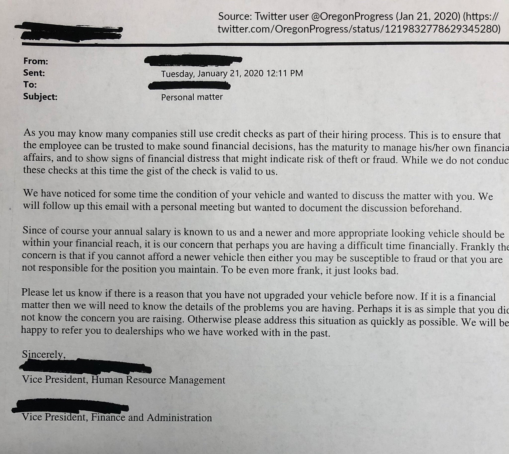

## Employment as Private Government 

> Imagine a government that assigns almost everyone a superior whom they must obey. Although superiors give most inferiors a routine to follow, there is no rule of law. Orders may be arbitrary and can change at any time, without prior notice or opportunity to appeal. Superiors are unaccountable to those they order around. They are neither elected nor removable by their inferiors. Inferiors have no right to complain in court about how they are being treated, except in a few narrowly defined cases. They also have no right to be consulted about the orders they are given.

Elizabeth Anderson, _Private Government: How Employers Rule Our Lives (and Why We Don't Talk about It)_

*** 

> This government does not recognize a personal or private sphere of autonomy free from sanction. It may prescribe a dress code and forbid certain hairstyles. Everyone lives under surveillance, to ensure that they are complying with orders. Superiors may snoop into inferiors’ e-mail and record their phone conversations. Suspicionless searches of their bodies and personal effects may be routine. They can be ordered to submit to medical testing. The government may dictate the language spoken and forbid communication in any other language. It may forbid certain topics of discussion. People can be sanctioned for their consensual sexual activity or for their choice of spouse or life partner. They can be sanctioned for their political activity and required to engage in political activity they do not agree with.

Elizabeth Anderson, _Private Government_

## The Employment Relationship 

### The Centrality of Employer Control

A hired worker is an employee if the hiring party has the _right to control_ the manner and means of performing the work; the worker is an independent contractor if the hiring party merely specifies the desired result but the worker has the right to decide how to accomplish it. 

### Scope of Employer Control 

In practice, employer control is not limited to the "manner and means of performing the work". It extends beyond the workplace and reaches into employees' off-duty conduct and personal lives. 

## Termination of Employment 

### Employment At Will   

> [I]n the absence of a contractual agreement between an employer and an employee establishing a definite term of employment, the relationship is presumed to be terminable at the will of either party without regard to the quality of performance of either party. 

_Kurtzman v. Applied Analytical Industries, Inc._, 493 S.E.2d 420 (N.C. 1997) 

### Economic & Social Realities of At-Will Employment     

### Formal Equality   

The at-will presumption is supposed to work both ways: 

- The employer is free to fire the employee at any time without needing a good reason. 
- The employee is likewise free to quit at any time without needing a good reason. 
- No requirement that either party give advance notice. 

### Constraints on Employee Mobility 

In practice, employees are often restrained or deterred from exercising their right to quit. 

- [Labor market monopsony](https://www.hamiltonproject.org/assets/files/protecting_low_income_workers_from_monopsony_collusion_krueger_posner_pp.pdf)
- Barriers to exit
	- Non-compete agreements 
	- [Training repayment obligations](https://www.emfink.net/ElonLaw/assets/pdf/Fink2018.pdf)
	- No-poaching agreements 

## Limits on Employer Control

The scope and exercise of employer control are limited only by specific exceptions or conditions imposed by law. 

- Regulation of terms and conditions
- Protection against discharge or other adverse action for particular reasons

### Terms and Conditions of Employment 

- Fair Labor Standards Act; state wage payment laws 
- Occupational Safety and Health Act 
- Americans with Disabilities Act
- National Labor Relations Act 

### Equal Employment Opportunity 

> It shall be an unlawful employment practice for an employer -
> 
> (1)\ to fail or refuse to hire or to discharge any individual, or otherwise to discriminate against any individual with respect to his compensation, terms, conditions, or privileges of employment, because of such individual’s race, color, religion, sex, or national origin.

Civil Rights Act of 1964, Title VII, 42 U.S.C. § 2000e-2

### Anti-Retaliation and Whistleblower Protections

> It shall be an unlawful employment practice for an employer to discriminate against any of his employees … because he has opposed any practice made an unlawful employment practice by this subchapter, or because he has made a charge, testified, assisted, or participated in any manner in an investigation, proceeding, or hearing under this subchapter.

Civil Rights Act of 1964, Title VII, 42 U.S.C. § 2000e-3

### Statutory Protection of Non-Work Activity 

> Unless otherwise provided by law, it shall be unlawful for any employer or employment agency to refuse to hire, employ or license, or to discharge from employment or otherwise discriminate against an individual in compensation, promotion or terms, conditions or privileges of employment because of:
> 
> a. an individual's political activities outside of working hours, off of the employer's premises and without use of the employer's equipment or other property, if such activities are legal … ;
> b. an individual's legal use of consumable products, including cannabis in accordance with state law, prior to the beginning or after the conclusion of the employee's work hours, and off of the employer's premises and without use of the employer's equipment or other property;
> c. an individual's legal recreational activities, including cannabis in accordance with state law, outside work hours, off of the employer's premises and without use of the employer's equipment or other property;

Discrimination Against the Engagement in Certain Activities, N.Y. Labor Law § 201-d(2)

### Public Policy 

> [W]hile there may be a right to terminate a contract at will for no reason, or for an arbitrary or irrational reason, there can be no right to terminate such a contract for an unlawful reason or purpose that contravenes public policy. A different interpretation would encourage and sanction lawlessness, which law by its very nature is designed to discourage and prevent.

[Coman v. Thomas Mfg. Co., Inc.](https://scholar.google.com/scholar_case?case=4152940208258731929), 381 SE 2d 445 (NC 1989), quoting Sides v. Duke University, 328 S.E.2d 818 (N.C. App. 1985)

### Alternative to At-Will

> A discharge is wrongful only if:
> 
> (a) it was in retaliation for the employee’s refusal to violate public policy or for reporting a violation of public policy;
> (b) the discharge was not for good cause and the employee had completed the employer’s probationary period of employment;
> (c) the employer materially violated an express provision of its own written personnel policy prior to the discharge, and the violation deprived the employee of a fair and reasonable opportunity to remain in a position of employment with the employer; or
> (d) the employer terminated the employee solely based on the employee’s legal expression of free speech, including but not limited to statements made on social media.

Montana Wrongful Discharge from Employment Act, 39-2-904

## Cases 

### Brunner v. Al Attar, 786 S.W.2d 784 (Tex. App. 1990) 

Brunner alleged that she was fired because her employer feared that she would catch and spread the Acquired Immune Deficiency Syndrome (AIDS) to employees. 

### State v. Wal-Mart Stores, 207 A.D.2d 150 (N.Y. App. Div. 1995) 

Wal-Mart fired two employees for violating its “fraternization“ policy, which prohibits a “dating relationship“ between a married employee and another employee, other than his or her own spouse.

### Hansen v. America Online, 96 P.3d 950 (Utah 2004)

AOL fired three employees for possessing guns in the company parking lot, in violation of its Workplace Violence Prevention Policy. 

### Wiegand v. Motiva Enterprises, LLC, 295 F. Supp. 2d 465 (D.N.J. 2003) 

Weigand was fired from his job at a gas station after local newspapers reported that he was operating a “mail order neo-Nazi skinhead music company“ and that he was a “personal friend and supporter“ of Katja Lane, the purported wife of Aryan Nation leader David Lane. 

## Discussion Problem

### Can My Boss Do That? 

## Further Reading 

Anderson, Elizabeth. [_Private Government: How Employers Rule Our Lives (and Why We Don't Talk about It_)](https://www.jstor.org/stable/j.ctvc775n0). Princeton University Press, 2017.

Braverman, Harry. [_Labor and Monopoly Capital: The Degradation of Work in the Twentieth Century_](https://www.jstor.org/stable/j.ctt9qfrkf). Monthly Review Press, 1974.

Orren, Karen. _Belated Feudalism: Labor, the Law, and Liberal Development in the United States._ Cambridge University Press, 1991.